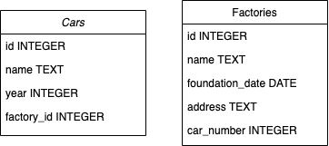

# PostgreSQL-Python-GUI
1. Описание предметной области:
* База данных машин и их производителей
* 2 таблицы: Cars и Factories
* Cars имеет поля: id (перв.ключ), name (имя авто/индекс), year (дата выпуска), factory_id (id производителя)
* Factories имеет поля: id(перв.ключ), name(название/индекс), foundation_date (дата основания компании), address (юр адрес), car_number (из таблицы cars, заполняется только триггером)
* id машин и производителей
* БД находится в 3 нормальной форме потому что каждый неключевой атрибут представляет информацию о ключе и ни о чём кроме ключа

Схема таблиц:  

